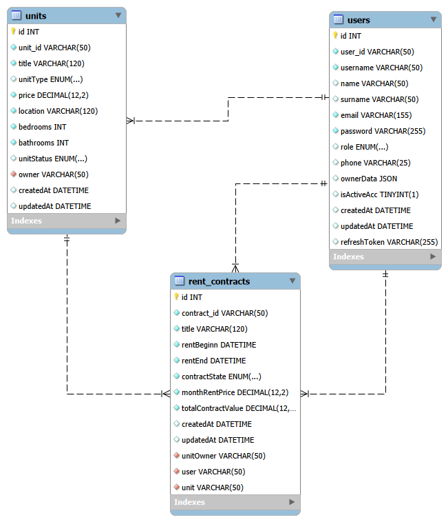
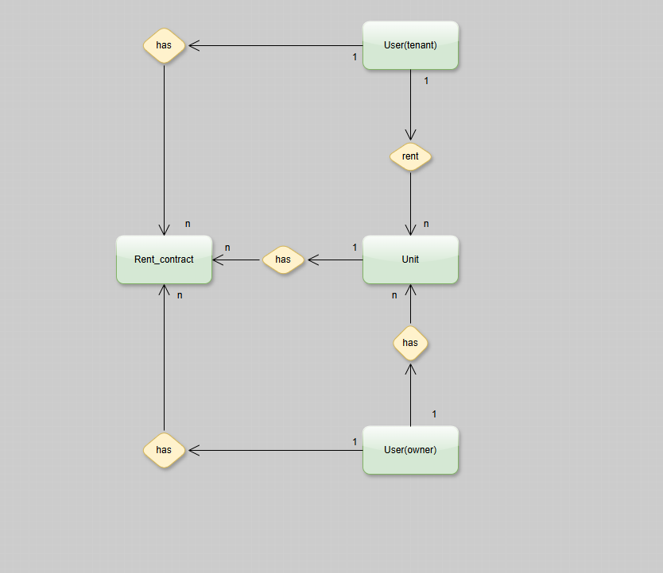
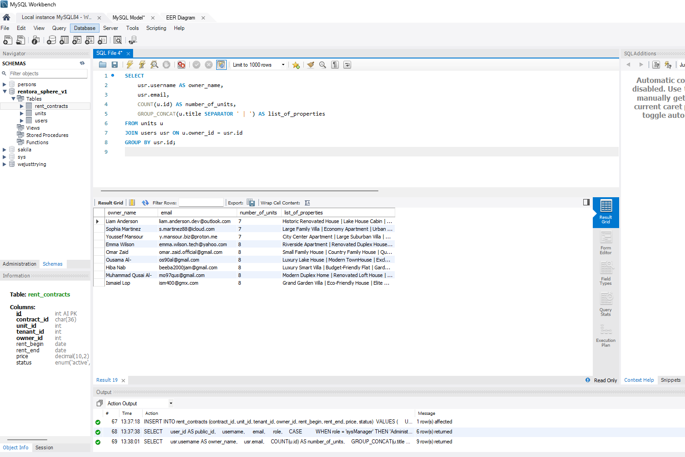
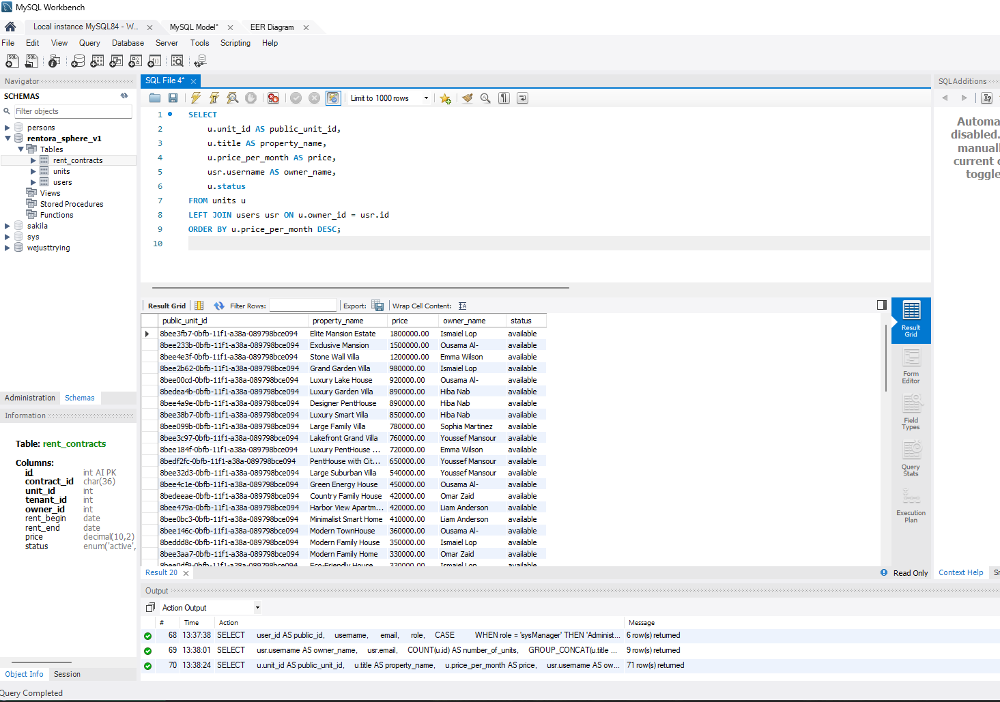
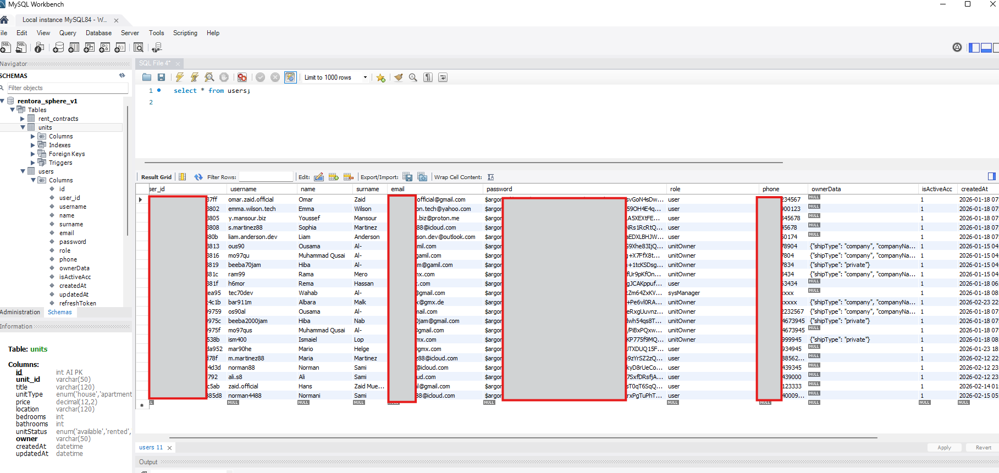

# [](https://git.io/typing-svg)

Relational database design for the Rentora Sphere rental management system, implemented in MySQL with a focus on schema integrity and ACID-compliant contract transactions.

[](https://www.mysql.com/)
[](https://app.diagrams.net/)
[](https://github.com/Wahab-Al/Rentora_Sphere_V1_SQL/blob/master/LICENSE)

---

## Context

This repository is the relational counterpart to [RentoraSphere](https://github.com/Wahab-Al/RentoraSphere) (MongoDB/Node.js). Before building the NoSQL API, the domain model was designed as a relational schema first normalizing entities, defining foreign key constraints, and working through the contract lifecycle at the data layer before any application code was written.

---

## The Design Problem

The core challenge in a rental system isn't the happy path, it's constraint enforcement:

- A unit can only have one active contract at a time
- A contract must reference both an existing unit and an existing tenant
- Deleting a user with active contracts should not silently orphan financial records
- Role distinctions (Owner, Tenant, sysManager) need to be enforceable at the data layer, not just the application layer

Relational constraints handle most of these naturally. The schema is designed so that the DB itself rejects invalid states, not just the API.

---

## Schema Overview

Three core entities, two relationship tables:

```
users
  └── role: ENUM('owner', 'tenant', 'sysManager')

units
  └── owner_id → users.id (CASCADE on owner delete policy)

contracts
  ├── unit_id  → units.id
  ├── tenant_id → users.id
  └── status: ENUM('pending', 'approved', 'rejected')
```

Contract status transitions are gated at the application layer (RentoraSphere API) but the FK constraints and NOT NULL rules ensure no contract can exist without valid references.

---

## Setup

```sql
CREATE SCHEMA rentora_sphere_v1;
```

Then run the schema script:

```bash
mysql -u root -p rentora_sphere_v1 < database/schema_v1.sql
```

Or import via **MySQL Workbench → File → Run SQL Script**.

---

## Relationship to RentoraSphere

| | SQL Version (this repo) | MongoDB Version |
|---|---|---|
| Purpose | Schema design & constraint modeling | Production API |
| Stack | MySQL 8.4 | Node.js + MongoDB + Mongoose |
| Constraints | FK constraints, ENUM, NOT NULL | Schema-level validation (Zod + Mongoose) |
| Contract flow | Status ENUM in contracts table | Controller + service layer logic |

---

---

## ER Diagrams

**MySQL Workbench (Forward Engineering)**



**draw.io (Conceptual)**



---

## Sample Data

**Owners & their Units**



**Units**



**Users**



## License

MIT
